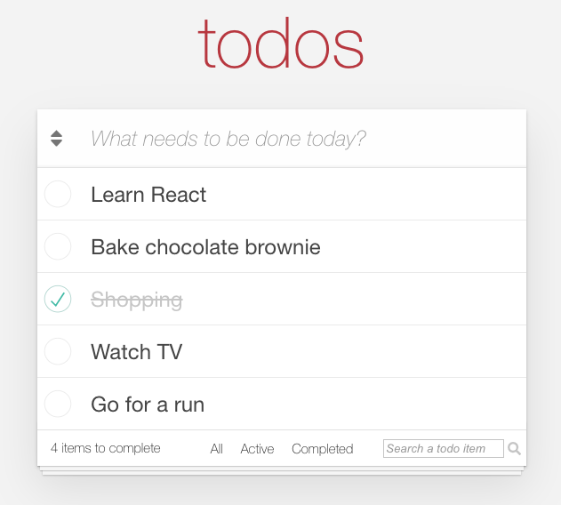

# CYF React Todo List

### How to use this repo?
The implementation of this todo list project is spread across several branches to show the progression of the code. 
The main branch contains a mostly empty project, acting as a starting point to build a Todo List application in React.
This initial empty project has been created with `create-react-app` and the package `todomvc-app-css` has been included to get CSS styles ready to use.

The following features have been implemented:

- Step 0 ([`main`][branch-main] branch): empty project, static todo list structure with some CSS styles applied.
- Step 1 ([`step-1`][branch-step-1] branch): Add a new todo item and display all the todo items in a list. ([changes][diff-1])
- Step 2 ([`step-2`][branch-step-2] branch): Delete a todo item. ([changes][diff-2])
- Step 3 ([`step-3`][branch-step-3] branch): Mark a todo item as completed. ([changes][diff-3])
- Step 4 ([`step-4`][branch-step-4] branch): Display the number of items to complete.  ([changes][diff-4])
- Step 5 ([`step-5`][branch-step-5] branch): Filter todo items: All, Active, Completed.  ([changes][diff-5])
- Step 6 ([`step-6`][branch-step-6] branch): Update a todo item. ([changes][diff-6])
- Step 7 ([`step-7`][branch-step-7] branch): Sort todo items alphabetically. ([changes][diff-7])
- Step 8 ([`step-8`][branch-step-8] branch): Search todo items. ([changes][diff-8])

Try to complete each step progressively from the main branch. 
To check the solution for a given step, check the corresponding branch. For example, if you want to see the solution for Step 5, check the branch `step-5`. In each branch, this file `README.md` will be updated to give some tips and explanation on how to implement the step.
Don't worry if your solution is different with the one in this repo! There may be different options to solve this exercise.

Enjoy!

[branch-main]: https://github.com/llh1/cyf-react-todolist/tree/main
[branch-step-1]: https://github.com/llh1/cyf-react-todolist/tree/step-1
[branch-step-2]: https://github.com/llh1/cyf-react-todolist/tree/step-2
[branch-step-3]: https://github.com/llh1/cyf-react-todolist/tree/step-3
[branch-step-4]: https://github.com/llh1/cyf-react-todolist/tree/step-4
[branch-step-5]: https://github.com/llh1/cyf-react-todolist/tree/step-5
[branch-step-6]: https://github.com/llh1/cyf-react-todolist/tree/step-6
[branch-step-7]: https://github.com/llh1/cyf-react-todolist/tree/step-7
[branch-step-8]: https://github.com/llh1/cyf-react-todolist/tree/step-8

[diff-1]: https://github.com/llh1/cyf-react-todolist/compare/main...step-1
[diff-2]: https://github.com/llh1/cyf-react-todolist/compare/step-1...step-2
[diff-3]: https://github.com/llh1/cyf-react-todolist/compare/step-2...step-3
[diff-4]: https://github.com/llh1/cyf-react-todolist/compare/step-3...step-4
[diff-5]: https://github.com/llh1/cyf-react-todolist/compare/step-4...step-5
[diff-6]: https://github.com/llh1/cyf-react-todolist/compare/step-5...step-6
[diff-7]: https://github.com/llh1/cyf-react-todolist/compare/step-6...step-7
[diff-8]: https://github.com/llh1/cyf-react-todolist/compare/step-7...step-8
